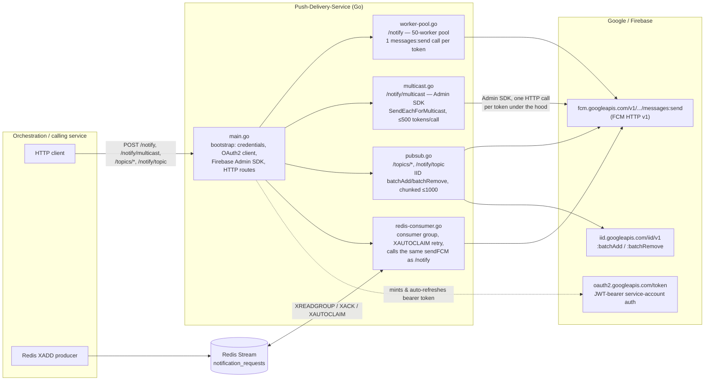

# Push Notification Service — Technical API Documentation

The complete API surface of this service: every HTTP endpoint it exposes,
every Google/Firebase API it calls to implement them, and the exact
request/response/error shape at each hop. Payload limits, quotas, and the
full error-code table already live in
[fcm-api-reference.md](./fcm-api-reference.md) — this document links to
that one instead of repeating it, and stays focused on "what do I send,
what do I get back, what can go wrong."

**On sourcing:** every external API fact below is cited to its official
Google/Firebase page (§6). Direct fetches to `firebase.google.com` and
`developers.google.com` are blocked from this environment's network, so
each was retrieved via search against the official page rather than a
raw fetch — the linked page remains the source of truth; nothing below is
sourced from a blog, forum, or AI-generated summary of Google's APIs.

---

## 1. Architecture



**Reading this diagram:** every arrow into `Google` is an authenticated
HTTPS call using the one OAuth2 client `main.go` builds at startup (§3.A).
There is no server-side fan-out anywhere in Google's v1 surface — `/notify`,
the Redis consumer, and `/notify/multicast` all end up issuing one
`messages:send`-equivalent call per device token; only the *concurrency
model* differs between them (a fixed worker pool vs. the Admin SDK's
internal batching). See
[fcm-internals-qa/01-broadcast-vs-direct-messaging.md](./fcm-internals-qa/01-broadcast-vs-direct-messaging.md)
for why that's true even for "multicast."

---

## 2. Go component inventory

| File | Responsibility | Calls out to |
|---|---|---|
| `main.go` | Loads service-account credential, builds the OAuth2 `httpClient` and the Firebase Admin `messagingClient`, registers HTTP routes, starts/stops the Redis consumer, graceful shutdown | Google OAuth2 token endpoint (indirectly, via `golang.org/x/oauth2/google`) |
| `worker-pool.go` | `/notify` handler; `sendToManyPooled` (fixed 50-worker pool); `sendFCM` (raw REST call + response parsing); `isRetryable` (FCM error-code classification) | FCM `messages:send` |
| `multicast.go` | `/notify/multicast` handler; `sendMulticast` (chunks at 500 tokens, calls the Admin SDK); `mapMulticastResults` / `isRetryableMulticastError` | Firebase Admin SDK `SendEachForMulticast` (→ FCM `messages:send` internally) |
| `pubsub.go` | `/topics/subscribe`, `/notify/topic`, `/topics/unsubscribe`; `sendTopicBatches` (chunks at 1000 tokens) | Instance ID `batchAdd`/`batchRemove`; FCM `messages:send` (topic target) |
| `redis-consumer.go` | Redis Stream intake for 1:1 sends; consumer group, `XAUTOCLAIM`-based retry, ack/dead-letter logic | FCM `messages:send` (via the same `sendFCM` as `/notify`) |

---

## 3. This service's own HTTP API

All endpoints accept/return `application/json` unless noted. All POST
endpoints reject unknown JSON fields and return `400` on a malformed body.

### `POST /notify`
Implemented by `notifyHandler` (`worker-pool.go`).

**Request**
```json
{ "deviceTokens": ["token1", "token2"], "title": "Price alert", "message": "Your order was filled" }
```
- `deviceTokens`: 1–1000 entries, non-empty strings (1000 is a self-imposed cap, not an FCM limit — see [fcm-api-reference.md §3](./fcm-api-reference.md#3-how-many-device-tokens-can-actually-be-sent--capacity-batching-and-overflow-handling)).
- `title`, `message`: required, non-blank.

**Response `200`** — always 200 once the request itself is valid; per-token outcomes are in `results`:
```json
{
  "status": "completed",
  "totalElapsedMs": 842,
  "results": [
    { "deviceToken": "token1", "success": true, "messageId": "projects/p/messages/0:1234", "latencyMs": 210 },
    { "deviceToken": "token2", "success": false, "error": "fcm error (status=404, code=UNREGISTERED): ...", "retryable": false, "latencyMs": 190 }
  ]
}
```
**Errors:** `400` (empty/oversized `deviceTokens`, blank `title`/`message`, invalid JSON), `405` (non-POST). A downstream FCM failure is never surfaced as a non-200 — it's a `success:false` entry in `results`.

### `POST /notify/multicast`
Implemented by `multicastNotifyHandler` (`multicast.go`). Same request shape and validation as `/notify` (including the same 1000-token self-imposed cap), sent through the Firebase Admin SDK instead of the hand-rolled REST call — an independent path, not a replacement for `/notify`.

**Response `200`:**
```json
{
  "status": "completed",
  "totalElapsedMs": 733,
  "results": [
    { "deviceToken": "token1", "success": true, "messageId": "projects/p/messages/0:1234" },
    { "deviceToken": "token2", "success": false, "error": "...", "retryable": false }
  ]
}
```
Note the one structural difference from `/notify`: `MulticastResult` has no `latencyMs` field (per-token timing isn't exposed by the SDK's batch call).

**Errors:** `400` (same validation as `/notify`), `405`, `502` if the underlying `SendEachForMulticast` call itself fails outright (network/auth/malformed request — no per-token breakdown is possible in that case, since Google never returned one).

### `POST /topics/subscribe` / `POST /topics/unsubscribe`
Implemented by `topicSubscribeHandler` / `topicUnsubscribeHandler` (`pubsub.go`), mirror images calling `batchAdd`/`batchRemove` respectively.

**Request**
```json
{ "topic": "prices", "deviceTokens": ["token1", "token2"] }
```
**Response `200`:**
```json
{
  "tokenCount": 2,
  "batches": [
    { "tokenCount": 2, "statusCode": 200, "body": { "results": [{}, { "error": "NOT_FOUND" }] } }
  ]
}
```
`deviceTokens` larger than 1000 (Google's real IID cap) produces more than one entry in `batches`, one per chunk — see [fcm-api-reference.md §6](./fcm-api-reference.md#6-topic-messaging-and-the-instance-id-api). A chunk that fails before Google responds (network error) reports `error` instead of `statusCode`/`body`.

**Errors:** `400` (missing `topic` or empty `deviceTokens`).

### `POST /notify/topic`
Implemented by `topicNotifyHandler` (`pubsub.go`).

**Request**
```json
{ "topic": "prices", "title": "Market update", "body": "Indices closed up 1.2%", "data": { "symbol": "NIFTY" } }
```
**Response:** forwarded verbatim from FCM — this handler passes through FCM's own status code and body unmodified, so the response is either FCM's success shape or FCM's error shape (§3.B/§4).

**Errors:** `400` (missing `topic`), `502` (the outbound call to FCM failed before any response was received). Any FCM-side error (e.g. malformed `data`, oversized payload) is passed through with FCM's own status code, not translated by this app.

### `GET /healthz`
Always `200`, no body, no downstream check — process liveness only.

### `GET /readyz`
`200` if a Redis `PING` succeeds within 1 second; `503` "Redis is unavailable" otherwise. Does **not** check reachability of any Google API — a `readyz` pass does not guarantee FCM is reachable.

### Redis Stream intake (async, not HTTP)
Implemented by `redis-consumer.go`. Not a request/response API, but has the same contract shape:

| | |
|---|---|
| Stream / group | `notification_requests` / `push-delivery` (both env-configurable) |
| Entry format | One field named `payload`, whose value is a JSON `NotificationRequest` — **must contain exactly one token** (`validRedisNotificationRequest`); a multi-token entry is rejected and acked/dropped, since a partial retry could otherwise re-send a token that already succeeded |
| Success | `XAck`'d after `sendFCM` returns success |
| Retryable failure | **Not** acked; picked back up by `XAUTOCLAIM` after `REDIS_RECLAIM_AFTER_SECONDS` (default 10s) of idle time |
| Permanent failure | Acked immediately and dropped — classified via `isPermanentFCMError` (string match on `INVALID_ARGUMENT`/`UNREGISTERED`/`SENDER_ID_MISMATCH` in the error) |
| Malformed entry | Acked immediately and dropped (invalid JSON, wrong token count, blank fields) |
| Concurrency | Up to `REDIS_PARALLELISM` (default 64) entries processed concurrently per `XReadGroup` batch of `REDIS_BATCH_SIZE` (default 64) |

Full walkthrough with example `redis-cli` commands: [local-redis-1to1-delivery.md](./local-redis-1to1-delivery.md).

---

## 4. External Google / Firebase APIs this service calls

### A. Google OAuth2 service-account token (JWT-bearer flow)
| | |
|---|---|
| Endpoint | `POST https://oauth2.googleapis.com/token` |
| Called from | `main.go`, indirectly — `golang.org/x/oauth2/google.JWTConfigFromJSON(...).Client(ctx)` mints and silently auto-refreshes the token on every request made through the returned `httpClient`; no code in this repo calls the endpoint directly |
| Scope requested | `https://www.googleapis.com/auth/firebase.messaging` |
| Request (per RFC/Google's doc) | Form-encoded: `grant_type=urn:ietf:params:oauth:grant-type:jwt-bearer&assertion=<signed JWT>` |
| Response | `{ "access_token": "...", "scope": "...", "token_type": "Bearer", "expires_in": 3600 }` |
| Token lifetime | 1 hour, refreshed transparently by the `oauth2` library — no app code involved |
| Errors | Standard OAuth2 error body (`invalid_grant`, `invalid_client`, etc.) — surfaces as a Go `error` from the first outgoing call if minting fails (bad key, revoked service account, clock skew) |
| Source | [Using OAuth 2.0 for Server to Server Applications](https://developers.google.com/identity/protocols/oauth2/service-account) |

### B. FCM HTTP v1 `messages:send`
| | |
|---|---|
| Endpoint | `POST https://fcm.googleapis.com/v1/projects/{project_id}/messages:send` |
| Called from | `sendFCM` (`worker-pool.go`) — used by `/notify` and the Redis consumer; `topicNotifyHandler` (`pubsub.go`) — `/notify/topic`; internally by the Admin SDK's `SendEachForMulticast` (`multicast.go`) |
| Auth | `Authorization: Bearer <token>` from §4.A's client |
| Request body | `{"message": {<one of "token"\|"topic"\|"condition">, "notification": {"title","body"}, "data": {...}, "android": {...}, "apns": {...}, "webpush": {...}, "fcm_options": {...}}}` — full field list: [`Message` resource](https://firebase.google.com/docs/reference/fcm/rest/v1/projects.messages#Message). This app only ever sets `token` or `topic` (never `condition`), `notification{title,body}`, `android.priority:"high"`, and `apns.headers["apns-priority"]:"10"` — never `data` on the direct/multicast/Redis paths, and never `webpush`. |
| Success response | `200`, `{ "name": "projects/{project_id}/messages/{message_id}" }` — this is the value surfaced as `messageId` in `/notify` and `/notify/multicast` responses |
| Error response | Non-2xx, Google's standard API error envelope: `{ "error": { "code": <int>, "message": "<string>", "status": "<FCM error code>" } }`. `status` carries one of FCM's documented codes (`UNREGISTERED`, `INVALID_ARGUMENT`, `SENDER_ID_MISMATCH`, `QUOTA_EXCEEDED`, `UNAVAILABLE`, `INTERNAL`, `THIRD_PARTY_AUTH_ERROR`, `UNSPECIFIED_ERROR`) — full table with retryability: [fcm-api-reference.md §5](./fcm-api-reference.md#5-fcm-http-v1-api--error-codes-and-retry-semantics) |
| Sources | [Send a message using FCM HTTP v1 API](https://firebase.google.com/docs/cloud-messaging/send/v1-api) · [REST Resource: projects.messages](https://firebase.google.com/docs/reference/fcm/rest/v1/projects.messages) · [FCM Error Codes reference](https://firebase.google.com/docs/reference/fcm/rest/v1/ErrorCode) |

### C. Instance ID API `batchAdd` / `batchRemove`
| | |
|---|---|
| Endpoints | `POST https://iid.googleapis.com/iid/v1:batchAdd`, `POST https://iid.googleapis.com/iid/v1:batchRemove` |
| Called from | `sendTopicBatches` (`pubsub.go`) — `/topics/subscribe` and `/topics/unsubscribe` |
| Auth | `Authorization: Bearer <token>` (same client as §4.A) **plus** the header `access_token_auth: true` — required since June 21, 2024, when these endpoints stopped accepting the legacy static server key |
| Request body | `{ "to": "/topics/{topic}", "registration_tokens": ["token1", "token2", ...] }` — capped by Google at 1,000 tokens per call; requests larger than that are chunked by `chunkTokens` into multiple calls |
| Response | `200`, `{ "results": [ {}, { "error": "NOT_FOUND" }, {} ] }` — one entry per input token, in order; an empty object means success, an `error` string (e.g. `NOT_FOUND`, `INVALID_ARGUMENT`, `INTERNAL`) means that one token failed. A `200` with per-token errors inside `results` is normal — it does not mean the whole call failed. |
| Source | [Instance ID API — Server Reference](https://developers.google.com/instance-id/reference/server) |

### D. Firebase Admin SDK `SendEachForMulticast` (no separate REST endpoint)
| | |
|---|---|
| Called from | `sendMulticast` (`multicast.go`) |
| What it actually is | A Go SDK convenience method, not a Google server endpoint — internally it issues up to 500 individual `messages:send` calls (§4.B) per invocation and collects the results client-side. This app chunks any request over 500 tokens into multiple calls, since Google hard-rejects a single call above that. |
| Go return type | `*messaging.BatchResponse{ SuccessCount int, FailureCount int, Responses []*messaging.SendResponse }`, where `SendResponse{ Success bool, MessageID string, Error error }` — never serialized as-is; `mapMulticastResults` converts it into this app's own `MulticastResult` JSON (§3) |
| Errors | A returned `error` from the call itself means the whole batch failed before any per-token breakdown existed (network/auth/malformed request); a per-token `SendResponse.Error` is classified by `isRetryableMulticastError` using the SDK's typed helpers (`messaging.IsUnregistered`, `IsInvalidArgument`, `IsSenderIDMismatch`, `IsUnavailable`, `IsInternal`, `IsQuotaExceeded`) — the same classification as §4.B's error codes, just via SDK helper functions instead of parsing the JSON error body by hand |
| Source | [`messaging` package reference (pkg.go.dev)](https://pkg.go.dev/firebase.google.com/go/v4/messaging) — see `BatchResponse`, `SendResponse`, and the `Is*` error-check functions |

---

## 5. Error handling — quick summary

Full classification table, retry semantics, and Google's own backoff
guidance: [fcm-api-reference.md §5](./fcm-api-reference.md#5-fcm-http-v1-api--error-codes-and-retry-semantics)
and [fcm-internals-qa/02-broadcast-retry-and-failure-handling.md](./fcm-internals-qa/02-broadcast-retry-and-failure-handling.md).

| Failure class | Example codes | This service's behavior |
|---|---|---|
| Permanent (dead token / bad request) | `UNREGISTERED`, `INVALID_ARGUMENT`, `SENDER_ID_MISMATCH` | `/notify`, `/notify/multicast`: reported as `success:false, retryable:false`. Redis path: acked and dropped, never retried. |
| Transient (Google-side) | `UNAVAILABLE`, `INTERNAL`, `QUOTA_EXCEEDED` | `/notify`, `/notify/multicast`: reported as `success:false, retryable:true` (caller decides what to do). Redis path: left unacked, retried by `XAUTOCLAIM` after `REDIS_RECLAIM_AFTER_SECONDS`. |
| Network/transport failure (this app ↔ Google) | timeouts, connection errors | Treated as retryable on every path. |
| Malformed inbound request (client ↔ this service) | empty/oversized `deviceTokens`, blank `title`/`message`, bad JSON | `400`, request never reaches Google. |

---

## 6. Configuration reference

Full list with examples: [`src/.env.example`](../src/.env.example).

| Variable | Default | Purpose |
|---|---|---|
| `PROJECT_ID` | — (required) | Firebase project ID; builds the `messages:send` URL and pins the Admin SDK's project |
| `PORT` | `8080` | HTTP listen port |
| `FIREBASE_SERVICE_ACCOUNT_JSON` / `_BASE64` / `GOOGLE_APPLICATION_CREDENTIALS` | — | One of these three must supply the service-account credential |
| `REDIS_ADDR` | `localhost:6379` | Redis connection |
| `REDIS_STREAM` / `REDIS_GROUP` | `notification_requests` / `push-delivery` | Stream and consumer group names |
| `REDIS_BATCH_SIZE` / `REDIS_PARALLELISM` | `64` / `64` | Entries per `XReadGroup` call / concurrent sends per batch |
| `REDIS_RECLAIM_AFTER_SECONDS` | `10` | Idle time before `XAUTOCLAIM` retries a message; must exceed the 5s FCM HTTP timeout |

---

## 7. Official source index

- [Send a message using FCM HTTP v1 API](https://firebase.google.com/docs/cloud-messaging/send/v1-api)
- [REST Resource: projects.messages](https://firebase.google.com/docs/reference/fcm/rest/v1/projects.messages)
- [FCM Error Codes reference](https://firebase.google.com/docs/reference/fcm/rest/v1/ErrorCode)
- [FCM Error Codes guide](https://firebase.google.com/docs/cloud-messaging/error-codes)
- [Instance ID API — Server Reference](https://developers.google.com/instance-id/reference/server)
- [Using OAuth 2.0 for Server to Server Applications](https://developers.google.com/identity/protocols/oauth2/service-account)
- [Migrate from legacy FCM APIs to HTTP v1](https://firebase.google.com/docs/cloud-messaging/migrate-v1) (confirms `SendEachForMulticast`'s 500-token client-side batching)
- [`firebase.google.com/go/v4/messaging` package reference](https://pkg.go.dev/firebase.google.com/go/v4/messaging)
