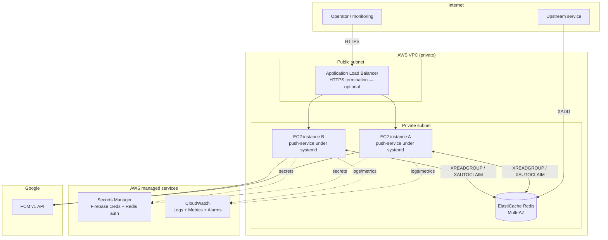

# Production Deployment Explained: EC2 + systemd + ElastiCache

The single, comprehensive production deployment guide for this service —
architecture, exact purpose of every component, the full build-out
walkthrough, cost, security, observability, and a migration path from the
POC. Companion to [poc-deployment-explained.md](./poc-deployment-explained.md),
mirroring its structure so the two can be read (or presented) side by side.

---

## 1. Executive summary

The recommended production architecture runs the same Go binary as the POC,
unchanged, but on **AWS EC2 instances supervised by `systemd`**, talking to
**AWS ElastiCache (managed Redis)** inside a **private VPC**, instead of
Render + Upstash. Nothing about the application code changes — only where
and how it runs.

**Why this shape, in one sentence:** this app is a long-lived background
consumer with a light HTTP surface on top, not a bursty request/response
API — that workload shape is naturally suited to a small number of
always-on virtual machines, not to scale-to-zero or serverless platforms
(which reintroduce the exact cold-start and consumer-gap problems the POC
has).

**Rough cost:** ~$26–31/month without external HTTP access, ~$42–51/month
with a load balancer in front (§8) — a deliberate, budgeted infrastructure
decision, versus the POC's $0 that depends on staying asleep most of the
time.

A faster, lower-effort alternative (Path B: paid managed PaaS instead of
AWS) is presented alongside the main recommendation in §5, for a team that
wants the POC's gaps closed without taking on AWS operations yet.

---

## 2. Architecture at a glance



### How it works, step by step

1. The Go binary is cross-compiled for Linux on a build machine (§6.2) and
   copied onto each EC2 instance.
2. `systemd` on each instance starts the binary as a supervised background
   service (§6.4), reading its configuration from an environment file whose
   secrets are sourced from Secrets Manager.
3. On startup, `main()` runs exactly as it does in the POC: it loads the
   Firebase credential, connects to ElastiCache Redis (now reachable only
   over the private VPC network, not the public internet), creates the
   consumer group if needed, and starts the `consumeLoop`/`reclaimLoop`
   goroutines alongside the HTTP server — this **never stops** unless the
   instance itself is stopped or the process crashes (in which case
   `systemd` restarts it automatically, per `Restart=on-failure`).
4. Because **two (or more) EC2 instances run the same binary against the
   same `REDIS_GROUP`**, Redis's consumer-group mechanics automatically
   split incoming stream entries between them and reassign any entry an
   instance fails to finish (`XAUTOCLAIM`) — this is the exact mechanism
   already built into `src/redis-consumer.go`, simply run on more than one
   host for the first time.
5. If the HTTP endpoints need to be reachable from outside the VPC, an ALB
   in the public subnet terminates HTTPS and forwards to whichever EC2
   instance is healthy; if every caller already lives inside the VPC, the
   ALB is skipped entirely and both instances stay fully private.
6. Logs and metrics flow continuously to CloudWatch regardless of whether
   anyone is actively looking — this is the direct fix for the POC's
   "only Render's log viewer, checked by hand" limitation.

---

## 3. Purpose of every component, explicitly

- **EC2's purpose:** provide the actual virtual machine(s) that run the
  compiled Go binary continuously, with full control over the OS,
  networking, and lifecycle. It is the direct, always-on replacement for
  Render's ephemeral, scale-to-zero container.
- **systemd's purpose:** supervise the Go binary as a persistent background
  service on that VM — start it on boot, restart it automatically if it
  crashes (`Restart=on-failure`), run it as an unprivileged, sandboxed user
  (`NoNewPrivileges`, `PrivateTmp`), and give operators a standard interface
  (`systemctl`, `journalctl`) instead of a hand-rolled process-management
  script.
- **ElastiCache's purpose:** the production replacement for Upstash — a
  managed Redis engine hosting the same `notification_requests` stream, but
  reachable only from inside the private VPC, with flat/predictable pricing
  and no per-command billing ceiling to watch.
- **VPC + private subnets + security groups' purpose:** network isolation.
  They guarantee Redis is never reachable from the public internet — only
  the app instances' own security group is permitted to talk to it — which
  directly closes the POC's "Redis reachable over the public internet" gap.
- **Application Load Balancer's purpose (optional):** if `/notify` and
  `/topics/*` must be callable from outside the VPC, the ALB terminates
  HTTPS and distributes requests across the EC2 instances. If every caller
  of the HTTP API already lives inside the VPC, skip the ALB entirely and
  keep everything private — saving its cost (§8).
- **Secrets Manager's purpose:** store the Firebase service-account
  credential and the Redis auth password outside of any plaintext config
  file, with access controlled by IAM rather than filesystem permissions
  alone.
- **CloudWatch's purpose:** collect the app's existing log lines
  (`[AUDIT]`, `[BATCH]`, `[REDIS]`) and turn specific patterns into metrics
  and alarms — replacing "read logs by hand over SSH" with automated
  detection of problems (§9).
- **IAM instance profile's purpose:** grant the EC2 instances
  least-privilege permission to read only the specific secrets they need
  from Secrets Manager — nothing else in the AWS account.
- **Auto Scaling Group's purpose (recommended, not strictly required to
  start):** automatically replace an EC2 instance that fails its health
  check, and provide a ready-made mechanism for adding more instances later
  without manual provisioning.
- **Do we need Docker here?** No. This path runs the Go binary directly on
  the host via `systemd` — there is no container runtime involved anywhere
  in this architecture. Docker (see
  [poc-deployment-explained.md §7](./poc-deployment-explained.md)) only
  re-enters the picture if the team later chooses a containerized
  production path instead (ECS/Fargate, Kubernetes) — the same
  already-validated `Dockerfile` would carry over unchanged in that case.

---

## 4. What production actually requires, derived from the POC's gaps

Every row here is a direct consequence of a limitation documented in §9 and
§11 of the POC deep-dive:

| POC gap | Production requirement | Closed by |
|---|---|---|
| Compute sleeps after 15 min idle | Always-on compute — the process, and therefore the Redis consumer goroutines, must never stop | EC2 + systemd (§2, §6) |
| Redis consumer uptime tied to HTTP traffic | Consumer must run independent of any inbound request pattern | Same as above — no scale-to-zero layer in this architecture at all |
| Upstash's 500K commands/month cap | A Redis option with no per-command metering ceiling | ElastiCache (flat pricing) |
| `/notify` and `/topics/*` have zero authentication | An auth layer (API key, mTLS, or network isolation) in front of the public endpoints | §7, item 1 — must be added to the code independent of hosting |
| No monitoring/alerting | Metrics, log aggregation, and alarms on consumer lag and FCM error rate | CloudWatch (§9) |
| Redis reachable over the public internet | Redis in a private network, unreachable from outside the VPC | VPC + security groups (§3) |
| Single point of failure (one instance) | A restart/recovery story, and a path to running more than one instance safely | Two EC2 instances + the existing consumer-group design (§2) |
| Manual deploy via dashboard clicks | A repeatable, reviewable deploy pipeline | §10 |

---

## 5. Two viable production paths

### Path A (recommended): AWS EC2 + ElastiCache, in a private VPC

The rest of this document details Path A. **Why it's the primary
recommendation:** the app's own architecture is the deciding factor — a
long-lived background consumer with a light HTTP surface is naturally
suited to "a small number of always-on VMs," not to serverless/scale-to-zero
platforms. EC2 + ElastiCache also gives full control over networking (Redis
genuinely private, never internet-reachable) and predictable flat pricing
with no per-command metering ceiling to worry about as traffic grows.

### Path B (faster to stand up): managed always-on PaaS + managed Redis

If the team would rather not operate EC2 directly yet:
- **Render Starter plan** ($7/month, always-on, 0.5 vCPU / 512 MB, no
  spin-down) or **Fly.io** on an always-on machine (credit card required,
  small usage-based bill), instead of the free scale-to-zero tier.
- **Upstash on a Fixed plan** (flat monthly price, unlimited commands —
  removes the 500K/month ceiling entirely) instead of pay-as-you-go.

This closes the two biggest POC gaps (sleep + Redis quota) with almost no
code or architecture change, at low cost, and with much less operational
work than running EC2 yourself. It's a reasonable "production-lite"
stop-gap while EC2 is being set up properly, or a permanent choice if the
team explicitly prefers to stay off self-managed infrastructure. Since
Path A's Dockerfile is already validated (see the POC document), the same
container would also work unchanged on Render's paid Docker-based plans.

### Comparison table

| | Path A: EC2 + ElastiCache | Path B: Render Starter + Upstash Fixed |
|---|---|---|
| Always-on | Yes | Yes |
| Redis network isolation | Full (private VPC, no public exposure) | No — Upstash is reached over the internet (TLS-protected) |
| Predictable flat cost | Yes | Yes |
| Operational burden | Higher (you own patching, systemd, VPC, IAM) | Lower (fully managed) |
| Horizontal scaling | Native — consumer group already supports multiple instances (add EC2 instances behind an ASG) | Possible but coarser-grained (bump Render instance count/plan) |
| Vendor lock-in | Low (portable to any VM/cloud) | Higher (Render/Upstash-specific) |
| Rough monthly cost (see §8) | ~$26–51 | ~$17–27 |

**Recommendation to bring to the meeting:** start with **Path A** as the
target architecture given the consumer-shaped workload and the security
requirement to keep Redis off the public internet, but mention **Path B** as
a legitimate, cheaper-to-operate fallback if the team wants to defer AWS
account/VPC setup.

---

## 6. Deployment walkthrough (Path A)

### 6.1 Before deploying

- Use an EC2 Linux instance and a non-root service account such as
  `pushsvc`.
- Put EC2 and Redis in the same private VPC. Redis must not be public.
- Permit EC2 outbound TCP 443 to Firebase and TCP 6379 (or your TLS Redis
  port) to Redis. No inbound app port is required for Redis consumption.
- Open inbound 8080 only if the HTTP endpoints are actually required. Put
  an ALB with HTTPS in front of them for external use.
- Store the Firebase service account and Redis password in Secrets Manager
  (§3), not a plaintext file.

### 6.2 Build a Linux binary

From `src`, using a Go version compatible with `go.mod`:

```powershell
# Windows PowerShell
$env:GOOS = "linux"
$env:GOARCH = "amd64"
$env:CGO_ENABLED = "0"
go build -o push-service .
Remove-Item Env:GOOS, Env:GOARCH, Env:CGO_ENABLED
```

```bash
# macOS/Linux
GOOS=linux GOARCH=amd64 CGO_ENABLED=0 go build -o push-service .
```

Build the package (`.`), not selected `.go` files — the Redis consumer
depends on types and FCM functions defined in the other source files in
`src/`.

Copy `push-service` to the EC2 instance, e.g. to
`/opt/push-service/push-service`. Do not commit a real `.env` or
service-account file into source control or a container image.

### 6.3 Runtime configuration

Create `/etc/push-service/push-service.env`, owned by `root:pushsvc` and
mode `0640`. Supply the secret values through your deployment system or
Secrets Manager integration — this file should hold references/placeholders
in source control, never real secrets.

```dotenv
PROJECT_ID=your-firebase-project-id
PORT=8080

REDIS_ADDR=your-redis.internal:6379
REDIS_USERNAME=default
REDIS_PASSWORD=replace-with-secret
REDIS_TLS=true
REDIS_STREAM=notification_requests
REDIS_GROUP=push-delivery
# Leave blank: each EC2 process creates a unique hostname/process identity.
REDIS_CONSUMER_NAME=
REDIS_BATCH_SIZE=64
REDIS_PARALLELISM=64
REDIS_RECLAIM_AFTER_SECONDS=10

# Prefer injecting this value from a secret manager.
FIREBASE_SERVICE_ACCOUNT_BASE64=replace-with-base64-service-account-json
```

Use `REDIS_TLS=false` only for local Redis or a deliberately non-TLS POC.
Set `REDIS_RECLAIM_AFTER_SECONDS` above five seconds because FCM calls time
out after five seconds.

### 6.4 systemd unit

Create `/etc/systemd/system/push-service.service`:

```ini
[Unit]
Description=Push Notification Delivery Service
Wants=network-online.target
After=network-online.target

[Service]
Type=simple
User=pushsvc
Group=pushsvc
WorkingDirectory=/opt/push-service
ExecStart=/opt/push-service/push-service
EnvironmentFile=/etc/push-service/push-service.env
Restart=on-failure
RestartSec=5
NoNewPrivileges=true
PrivateTmp=true

[Install]
WantedBy=multi-user.target
```

Start and inspect it:

```bash
sudo systemctl daemon-reload
sudo systemctl enable --now push-service
sudo systemctl status push-service
sudo journalctl -u push-service -f
curl -fsS http://localhost:8080/healthz
curl -fsS http://localhost:8080/readyz
```

`/healthz` means the process is running. `/readyz` also checks Redis and is
the endpoint to use for a load balancer or deployment readiness check.

### 6.5 Producer contract

The upstream service must use a Redis client and execute one `XADD` per
device:

```text
XADD notification_requests * payload <JSON string>
```

```json
{"deviceTokens":["FCM_REGISTRATION_TOKEN"],"title":"Price alert","message":"Your order was filled"}
```

- The field is exactly `payload`.
- The JSON contains exactly one non-empty device token.
- `title` and `message` are required.
- An `XADD` success only confirms queue acceptance, not device delivery.
- Delivery is at least once; upstream business logic must tolerate
  duplicates.
- Include a unique business notification ID in upstream audit data. The
  current payload schema does not persist or deduplicate that ID yet.

---

## 7. Security hardening checklist

Ordered roughly by how urgent each item is:

1. **Authenticate `/notify` and the `/topics/*` endpoints.** Right now,
   anyone who obtains the URL can send arbitrary pushes through your
   Firebase project — there is no API key check, no mTLS, nothing. At
   minimum, add a shared-secret header validated before processing, or put
   these endpoints behind the ALB with a WAF rule / IP allowlist
   restricting callers to known upstream services. This should happen
   **before** any production deploy, independent of hosting choice.
2. **Move Redis off the public internet.** ElastiCache in a private
   subnet, security group scoped to only the app instances' security
   group.
3. **Secrets Manager instead of an env file** for the Firebase service
   account and Redis credentials — least-privilege IAM role on the EC2
   instance profile to read only those specific secrets.
4. **Non-root systemd user** — already specified above (`pushsvc`); carry
   it forward into any automation.
5. **Rotate the Firebase service-account key periodically** and store the
   rotation date somewhere visible (this credential doesn't expire on its
   own, so rotation has to be a deliberate habit).
6. **Restrict inbound security group rules** to exactly what's needed:
   outbound 443 to Firebase, outbound to ElastiCache's port, inbound only
   from the ALB (if used) or not at all otherwise.
7. **Enable VPC Flow Logs and CloudTrail** if this account doesn't already
   have them — cheap, and the first thing you'll want during an incident.

---

## 8. Cost breakdown (Path A, `us-east-1`, on-demand pricing)

| Item | Spec | Monthly cost |
|---|---|---|
| EC2 instance ×2 | `t4g.micro` (2 vCPU, 1 GB) | ~$6.13 each → **~$12.26** |
| ElastiCache node | `cache.t4g.micro` (Valkey/Redis engine) | **~$9.34–$11.68** |
| Secrets Manager | 2 secrets (Firebase cred, Redis auth) | **~$0.80** |
| CloudWatch | Logs ingestion + a handful of alarms, low volume | **~$3–5** |
| Data transfer | Small JSON payloads, low volume | **~$1–2** |
| **Subtotal (no external HTTP access needed)** | | **~$26–31/month** |
| ALB (only if `/notify` must be reachable externally) | Base + minimal LCUs | **+~$16–20** |
| **Total with ALB** | | **~$42–51/month** |

Notes:
- This assumes **on-demand** pricing. A 1-year Reserved Instance or Savings
  Plan commitment on the EC2 instances typically cuts that line item by
  30–40% once the deployment is stable and not expected to change shape.
- Running **one** EC2 instance instead of two (accepting a single point of
  failure, at least initially) roughly halves the EC2 line to ~$6/month —
  a reasonable way to start if budget is the binding constraint, since the
  consumer-group design makes adding the second instance later a
  configuration change, not a re-architecture.
- ElastiCache Multi-AZ (automatic failover) roughly doubles the Redis line
  item — worth it once this is carrying real user-facing traffic, skippable
  for an initial soft-launch.

### Cost comparison: Path B (Render Starter + Upstash Fixed)

| Item | Monthly cost |
|---|---|
| Render Starter (always-on, 0.5 vCPU / 512 MB) | **$7** |
| Upstash smallest Fixed plan (flat rate, unlimited commands) | **~$10** |
| **Total** | **~$17** |

Path B is cheaper and requires no AWS setup at all, at the cost of Redis
being reachable only over the public internet (TLS-protected, but not
network-isolated) and less control over scaling/placement.

---

## 9. Observability

- **Structured logs → CloudWatch Logs.** The app already logs meaningful
  lines (`[AUDIT]`, `[BATCH]`, `[REDIS] id=... success=...`) — ship these
  via the CloudWatch agent instead of reading them by hand over SSH.
- **Key metrics to track:**
  - FCM error rate (from the existing `success=false` log lines — a simple
    metric filter turns this into a CloudWatch metric).
  - Retry rate (`retryable=true` proportion) — a rising trend indicates FCM
    or network trouble upstream of this service.
  - **Consumer lag** — periodically run `XPENDING notification_requests
    push-delivery` (or better, a small sidecar/cron that does this and
    reports the count) and alarm if pending entries grow instead of
    shrinking. This is the single most important production health signal
    for this specific architecture: it directly answers "is the consumer
    keeping up."
  - `XLEN` growth over time — if it consistently outpaces consumption, it's
    a capacity signal to add another consumer instance.
- **Alarms:** consumer lag above a threshold, EC2 instance status check
  failures (paired with EC2 auto-recovery or an Auto Scaling Group with
  `min=max=desired` to replace a failed instance automatically), FCM error
  rate spikes.

---

## 10. Deployment pipeline

Replace "manually build and `scp` the binary" with:

1. **GitHub Actions** (or equivalent CI): on merge to the production
   branch, run `go vet`/`go test`, then cross-compile the Linux binary
   exactly as in §6.2.
2. **Artifact delivery:** upload the binary to S3, or build/push the
   existing `Dockerfile` to ECR if the team prefers container-based deploys
   down the line (already validated to compile correctly — see the POC
   document's §7).
3. **Rollout:** a small deploy script (or AWS CodeDeploy) that pulls the
   new binary onto each EC2 instance, restarts the systemd unit one
   instance at a time (rolling, not all-at-once) so the consumer group
   never has zero active consumers.
4. **Rollback:** keep the previous binary alongside the new one on each
   instance; a failed health check after deploy triggers restoring it and
   restarting the service.

---

## 11. Scaling strategy

- **Vertical first, if ever needed:** `t4g.micro` → `t4g.small` is a
  simple resize; the app's own worker pool (`REDIS_PARALLELISM`,
  `sendToManyPooled`'s 50-worker default for the HTTP path) already
  parallelizes FCM calls, so most headroom comes from more concurrent
  outbound HTTP calls, which benefits from more CPU/network capacity more
  than more instances, up to a point.
- **Horizontal, for real growth:** add EC2 instances to an Auto Scaling
  Group behind the same `REDIS_GROUP`. Each instance gets a unique consumer
  identity (`REDIS_CONSUMER_NAME` defaults to `hostname-pid` when left
  blank), and the consumer-group design already handles load distribution
  and failure recovery across instances with zero code changes — start at
  the default `REDIS_PARALLELISM=64`, measure FCM latency/error rate, and
  tune from there.
- **Redis scaling:** ElastiCache node type upgrade, or moving to a
  cluster-mode configuration, only once stream throughput or connection
  count actually approaches the current node's limits — not needed at
  today's scale.

---

## 12. Testing & validation tutorial

### 12.1 Confirm the service is alive and ready

```bash
curl -fsS http://localhost:8080/healthz   # from the instance itself
curl -fsS http://localhost:8080/readyz    # also checks Redis connectivity
```

Through the ALB, if one is deployed:
```bash
curl -fsS https://<alb-dns-name>/healthz
curl -fsS https://<alb-dns-name>/readyz
```

### 12.2 Watch the service logs live

```bash
sudo journalctl -u push-service -f
```
Look for `Redis notification consumer started...` on startup, and
`[REDIS]`/`[AUDIT]`/`[BATCH]` lines as traffic flows.

### 12.3 Send a real push end-to-end

```bash
curl -X POST http://localhost:8080/notify \
  -H "Content-Type: application/json" \
  -d '{"deviceTokens":["<REAL_FCM_TOKEN>"],"title":"Production test","message":"Hello from EC2"}'
```

### 12.4 Exercise the Redis 1:1 delivery path

From a host inside the VPC (or via SSH tunnel/bastion, since ElastiCache is
intentionally not internet-reachable):

```bash
redis-cli -h your-redis.internal -p 6379 --tls \
  XADD notification_requests '*' payload \
  '{"deviceTokens":["<REAL_FCM_TOKEN>"],"title":"Price alert","message":"Your order was filled"}'
```

### 12.5 Verify multi-instance consumer behavior

With two EC2 instances running:
```bash
redis-cli -h your-redis.internal -p 6379 --tls XINFO CONSUMERS notification_requests push-delivery
```
Expect to see **both** instances' consumer identities listed. Stop the
`push-service` unit on one instance (`sudo systemctl stop push-service`),
publish a few entries, and confirm the remaining instance picks up all of
them — then restart the stopped instance and confirm `XAUTOCLAIM` reassigns
anything still pending after `REDIS_RECLAIM_AFTER_SECONDS`.

### 12.6 Inspect queue health

```bash
redis-cli -h your-redis.internal -p 6379 --tls XLEN notification_requests
redis-cli -h your-redis.internal -p 6379 --tls XPENDING notification_requests push-delivery
```
This is the same "is the consumer keeping up" check as the POC, now backed
by CloudWatch alarms (§9) instead of a manual look.

---

## 13. Migration checklist: POC → production

1. Provision the VPC, subnets, security groups, ElastiCache node, EC2
   instance(s), and Secrets Manager entries (Path A), or upgrade the
   Render/Upstash plans (Path B).
2. Add authentication to `/notify` and `/topics/*` (§7, item 1) — do this
   in code before anything else, it's independent of hosting.
3. Point the upstream producer's `XADD` calls at the new Redis endpoint.
   **Do not delete the Upstash database immediately** — leave both
   reachable during a cutover window in case anything was still enqueued
   there, drain it, then decommission.
4. Deploy the app to the new instance(s), verify `/healthz`/`/readyz`,
   verify a real end-to-end push, verify the Redis consumer group shows the
   expected consumers via
   `XINFO CONSUMERS notification_requests push-delivery`.
5. Set up CloudWatch alarms *before* declaring this "production" — an
   unmonitored production deployment is not meaningfully different from
   the POC in terms of operational risk.
6. Update DNS/upstream configuration to point at the new public endpoint
   (if any), monitor closely for the first 24–48 hours, then decommission
   the Render/Upstash POC resources.

---

## 14. Anticipated questions — quick answers

- **"Why not just upgrade the Render/Upstash plan instead of AWS?"** That's
  Path B, and it's a legitimate answer — cheaper and less work. The
  recommendation to build on AWS instead is about the two things Path B
  can't give you: fully private Redis, and no per-command billing ceiling
  as usage scales. If those aren't priorities yet, lead with Path B.
- **"Why systemd instead of Docker/containers here?"** Because the
  recommended path is plain EC2 VMs, not a container platform — systemd is
  the standard, zero-extra-dependency way to supervise a long-running Linux
  process. The Dockerfile isn't wasted work either way: it's exactly what
  you'd reuse if the team later moves to ECS/Fargate or Kubernetes instead.
- **"What's the single biggest risk if we launched today?"** The
  unauthenticated `/notify` endpoint — that's a fix independent of hosting
  and should happen first regardless of which path is chosen.
- **"How do we know the consumer is keeping up in production?"** Watch
  `XPENDING` / `XLEN` growth via CloudWatch — that's the direct measure of
  "is the queue draining faster than it fills."
- **"What happens if one EC2 instance dies?"** With two instances in the
  consumer group, the other keeps consuming immediately; `XAUTOCLAIM`
  reclaims whatever the dead instance had in flight after
  `REDIS_RECLAIM_AFTER_SECONDS`. Pair this with EC2 auto-recovery or an ASG
  to replace the dead instance automatically.
- **"What's the realistic monthly cost?"** ~$26–31/month for Path A without
  external HTTP exposure, ~$42–51/month with an ALB, or ~$17/month for
  Path B — all far from AWS-scale spend, appropriate for this app's actual
  traffic shape.
