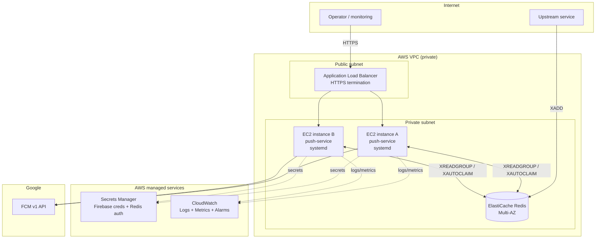

# Production-Grade Deployment Guide

What changes — and why — when this service moves from the free Render +
Upstash POC (documented in
[poc-deployment-explained.md](./poc-deployment-explained.md)) to something
built to actually serve real, time-sensitive push notifications. This
document gives a recommended path, a real cost estimate, and the concrete
engineering work involved, so it can be presented as a plan rather than a
vague "we'd need to productionize it."

---

## 1. What production actually requires, derived from the POC's gaps

Every item here is a direct consequence of a limitation documented in
§7 and §9 of the POC deep-dive:

| POC gap | Production requirement |
|---|---|
| Compute sleeps after 15 min idle | **Always-on compute** — the process, and therefore the Redis consumer goroutines, must never stop |
| Redis consumer uptime tied to HTTP traffic | Consumer must run independent of any inbound request pattern |
| Upstash's 500K commands/month cap | Either a metered plan sized for real 24/7 polling volume, or a non-metered (flat-rate / self-hosted) Redis |
| `/notify` and `/topics/*` have zero authentication | An auth layer (API key, mTLS, or network isolation) in front of the public endpoints |
| No monitoring/alerting | Metrics, log aggregation, and alarms on consumer lag and FCM error rate |
| Redis reachable over the public internet | Redis in a private network, unreachable from outside the VPC |
| Single point of failure (one instance) | A restart/recovery story, and a path to running more than one instance safely |
| Manual deploy via dashboard clicks | A repeatable, reviewable deploy pipeline |

---

## 2. Two viable production paths

### Path A (recommended): AWS EC2 + ElastiCache, in a private VPC

This is the path already partially documented in
[ec2-systemd-deployment.md](./ec2-systemd-deployment.md) — this guide
extends it with the operational pieces (security, observability, cost,
scaling, CI/CD) needed to actually call it "production."

**Why this is the primary recommendation:** the app's own architecture is
the deciding factor. This isn't a bursty request/response API that benefits
from autoscaling containers — it's a **long-lived background consumer**
attached to a Redis stream, with a comparatively light HTTP surface on top.
That shape is naturally suited to "a small number of always-on VMs," not to
serverless/scale-to-zero platforms (which reintroduce the exact cold-start
and consumer-gap problem the POC has). EC2 + ElastiCache also gives full
control over networking (Redis genuinely private, never internet-reachable)
and predictable flat pricing with no per-command metering ceiling to worry
about as traffic grows.

### Path B (faster to stand up): managed always-on PaaS + managed Redis

If the team would rather not operate EC2 directly yet, an intermediate step
is:
- **Render Starter plan** ($7/month, always-on, 0.5 vCPU / 512 MB, no
  spin-down) or **Fly.io** on an always-on machine (credit card required,
  small usage-based bill), instead of the free scale-to-zero tier.
- **Upstash on a Fixed plan** (flat monthly price, unlimited commands —
  removes the 500K/month ceiling entirely) instead of pay-as-you-go, so the
  consumer's constant polling has no metering risk.

This closes the two biggest POC gaps (sleep + Redis quota) with almost no
code or architecture change, at low cost, and with much less operational
work than running EC2 yourself. It's a reasonable "production-lite" stop-gap
while EC2 is being set up properly, or a permanent choice if the team
explicitly prefers to stay off self-managed infrastructure.

### Comparison table

| | Path A: EC2 + ElastiCache | Path B: Render Starter + Upstash Fixed |
|---|---|---|
| Always-on | Yes | Yes |
| Redis network isolation | Full (private VPC, no public exposure) | No — Upstash is reached over the internet (TLS-protected) |
| Predictable flat cost | Yes | Yes |
| Operational burden | Higher (you own patching, systemd, VPC, IAM) | Lower (fully managed) |
| Horizontal scaling | Native — consumer group already supports multiple instances (add EC2 instances behind an ASG) | Possible but coarser-grained (bump Render instance count/plan) |
| Vendor lock-in | Low (portable to any VM/cloud) | Higher (Render/Upstash-specific) |
| Rough monthly cost (see §4) | ~$20–35 | ~$17–27 |

**Recommendation to bring to the meeting:** start with **Path A** as the
target architecture given the consumer-shaped workload and the security
requirement to keep Redis off the public internet, but mention **Path B** as
a legitimate, cheaper-to-operate fallback if the team wants to defer AWS
account/VPC setup.

The rest of this document details Path A, since it's the recommendation;
Path B is a strict subset of effort (mostly "change two dashboard settings
and one pricing plan," no infrastructure to build).

---

## 3. Path A architecture

Key differences from the POC and from the base EC2 doc:

- **Two (or more) EC2 instances**, not one — the Redis **consumer group
  already supports this natively** (`REDIS_CONSUMER_NAME` defaults to a
  unique `hostname-pid`, so multiple instances split the stream's work
  automatically, and `XAUTOCLAIM` recovers work from a crashed instance).
  This is "horizontal scaling for free" — the code was already written for
  it, it's just never been run that way yet.
- **Redis (ElastiCache) has no public IP** — only the app's security group
  can reach it, on the VPC's private network.
- **An ALB in front**, only if the HTTP endpoints need to be reachable
  externally (per the existing EC2 doc's own guidance) — if `/notify` is
  only ever called by internal services, skip the ALB and keep everything
  private, saving ~$16/month base cost plus LCU charges.
- **Secrets Manager**, not a plaintext `.env` file, for the Firebase
  credential and Redis auth token.
- **CloudWatch** for logs, metrics, and alarms — replacing "read Render's
  log viewer by hand."

---

## 4. Cost breakdown (Path A, `us-east-1`, on-demand pricing)

| Item | Spec | Monthly cost |
|---|---|---|
| EC2 instance ×2 | `t4g.micro` (2 vCPU, 1 GB) | ~$6.13 each → **~$12.26** |
| ElastiCache node | `cache.t4g.micro` (Valkey/Redis engine) | **~$9.34–$11.68** |
| Secrets Manager | 2 secrets (Firebase cred, Redis auth) | **~$0.80** |
| CloudWatch | Logs ingestion + a handful of alarms, low volume | **~$3–5** |
| Data transfer | Small JSON payloads, low volume | **~$1–2** |
| **Subtotal (no external HTTP access needed)** | | **~$26–31/month** |
| ALB (only if `/notify` must be reachable externally) | Base + minimal LCUs | **+~$16–20** |
| **Total with ALB** | | **~$42–51/month** |

Notes:
- This assumes **on-demand** pricing. A 1-year Reserved Instance or Savings
  Plan commitment on the EC2 instances typically cuts that line item by
  30–40% once the deployment is stable and not expected to change shape.
- Running **one** EC2 instance instead of two (accepting a single point of
  failure, at least initially) roughly halves the EC2 line to ~$6/month —
  a reasonable way to start if budget is the binding constraint, since the
  consumer-group design makes adding the second instance later a
  configuration change, not a re-architecture.
- ElastiCache Multi-AZ (automatic failover) roughly doubles the Redis line
  item — worth it once this is carrying real user-facing traffic, skippable
  for an initial soft-launch.

### Cost comparison: Path B (Render Starter + Upstash Fixed)

| Item | Monthly cost |
|---|---|
| Render Starter (always-on, 0.5 vCPU / 512 MB) | **$7** |
| Upstash smallest Fixed plan (flat rate, unlimited commands) | **~$10** |
| **Total** | **~$17** |

Path B is cheaper and requires no AWS setup at all, at the cost of Redis
being reachable only over the public internet (TLS-protected, but not
network-isolated) and less control over scaling/placement.

---

## 5. Security hardening checklist

Ordered roughly by how urgent each item is:

1. **Authenticate `/notify` and the `/topics/*` endpoints.** Right now,
   anyone who obtains the URL can send arbitrary pushes through your
   Firebase project — there is no API key check, no mTLS, nothing. At
   minimum, add a shared-secret header validated before processing, or put
   these endpoints behind the ALB with a WAF rule / IP allowlist restricting
   callers to known upstream services. This should happen **before** any
   production deploy, independent of hosting choice.
2. **Move Redis off the public internet.** ElastiCache in a private subnet,
   security group scoped to only the app instances' security group.
3. **Secrets Manager instead of an env file** for the Firebase service
   account and Redis credentials — least-privilege IAM role on the EC2
   instance profile to read only those specific secrets.
4. **Non-root systemd user** — already specified in the base EC2 doc
   (`pushsvc`); carry it forward.
5. **Rotate the Firebase service-account key periodically** and store the
   rotation date somewhere visible (this credential doesn't expire on its
   own, so rotation has to be a deliberate habit).
6. **Restrict inbound security group rules** to exactly what's needed:
   outbound 443 to Firebase, outbound to ElastiCache's port, inbound only
   from the ALB (if used) or not at all otherwise.
7. **Enable VPC Flow Logs and CloudTrail** if this account doesn't already
   have them — cheap, and the first thing you'll want during an incident.

---

## 6. Observability

- **Structured logs → CloudWatch Logs.** The app already logs meaningful
  lines (`[AUDIT]`, `[BATCH]`, `[REDIS] id=... success=...`) — ship these via
  the CloudWatch agent instead of reading them by hand over SSH.
- **Key metrics to track:**
  - FCM error rate (from the existing `success=false` log lines — a simple
    metric filter turns this into a CloudWatch metric).
  - Retry rate (`retryable=true` proportion) — a rising trend indicates FCM
    or network trouble upstream of this service.
  - **Consumer lag** — periodically run `XPENDING notification_requests
    push-delivery` (or better, a small sidecar/cron that does this and
    reports the count) and alarm if pending entries grow instead of
    shrinking. This is the single most important production health signal
    for this specific architecture: it directly answers "is the consumer
    keeping up."
  - `XLEN` growth over time — if it consistently outpaces consumption, it's
    a capacity signal to add another consumer instance.
- **Alarms:** consumer lag above a threshold, EC2 instance status check
  failures (paired with EC2 auto-recovery or an Auto Scaling Group with
  `min=max=desired` to replace a failed instance automatically), FCM error
  rate spikes.

---

## 7. Deployment pipeline

Replace "manually build and `scp` the binary" with:

1. **GitHub Actions** (or equivalent CI): on merge to the production branch,
   run `go vet`/`go test`, then cross-compile the Linux binary exactly as
   documented in the existing EC2 doc (`GOOS=linux GOARCH=amd64 CGO_ENABLED=0 go build`).
2. **Artifact delivery:** upload the binary to S3, or build/push the
   existing `Dockerfile` to ECR if the team prefers container-based
   deploys down the line (the Dockerfile in this repo is already validated
   to compile correctly — see its accompanying commit).
3. **Rollout:** a small deploy script (or AWS CodeDeploy) that pulls the new
   binary onto each EC2 instance, restarts the systemd unit one instance at
   a time (rolling, not all-at-once) so the consumer group never has zero
   active consumers.
4. **Rollback:** keep the previous binary alongside the new one on each
   instance; a failed health check after deploy triggers restoring it and
   restarting the service.

---

## 8. Scaling strategy

- **Vertical first, if ever needed:** `t4g.micro` → `t4g.small` is a simple
  resize; the app's own worker pool (`REDIS_PARALLELISM`,
  `sendToManyPooled`'s 50-worker default for the HTTP path) already
  parallelizes FCM calls, so most headroom comes from more concurrent
  outbound HTTP calls, which benefits from more CPU/network capacity more
  than more instances, up to a point.
- **Horizontal, for real growth:** add EC2 instances to an Auto Scaling
  Group behind the same `REDIS_GROUP` — the consumer group design already
  handles load distribution and failure recovery across instances with zero
  code changes, per the existing EC2 doc's "Scaling" section.
- **Redis scaling:** ElastiCache node type upgrade, or moving to a
  cluster-mode configuration, only once stream throughput or connection
  count actually approaches the current node's limits — not needed at
  today's scale.

---

## 9. Migration checklist: POC → production

1. Provision the VPC, subnets, security groups, ElastiCache node, EC2
   instance(s), and Secrets Manager entries (Path A), or upgrade the
   Render/Upstash plans (Path B).
2. Add authentication to `/notify` and `/topics/*` (§5, item 1) — do this
   in code before anything else, it's independent of hosting.
3. Point the upstream producer's `XADD` calls at the new Redis endpoint.
   **Do not delete the Upstash database immediately** — leave both
   reachable during a cutover window in case anything was still enqueued
   there, drain it, then decommission.
4. Deploy the app to the new instance(s), verify `/healthz`/`/readyz`,
   verify a real end-to-end push, verify the Redis consumer group shows the
   expected consumers via `XINFO CONSUMERS notification_requests push-delivery`.
5. Set up CloudWatch alarms *before* declaring this "production" — an
   unmonitored production deployment is not meaningfully different from the
   POC in terms of operational risk.
6. Update DNS/upstream configuration to point at the new public endpoint
   (if any), monitor closely for the first 24–48 hours, then decommission
   the Render/Upstash POC resources.

---

## 10. Anticipated questions — quick answers

- **"Why not just upgrade the Render/Upstash plan instead of AWS?"** That's
  Path B, and it's a legitimate answer — cheaper and less work. The
  recommendation to build on AWS instead is about the two things Path B
  can't give you: fully private Redis, and no per-command billing ceiling
  as usage scales. If those aren't priorities yet, lead with Path B.
- **"What's the single biggest risk if we launched today?"** The
  unauthenticated `/notify` endpoint — that's a fix independent of hosting
  and should happen first regardless of which path is chosen.
- **"How do we know the consumer is keeping up in production?"** Watch
  `XPENDING` / `XLEN` growth via CloudWatch — that's the direct measure of
  "is the queue draining faster than it fills."
- **"What happens if one EC2 instance dies?"** With two instances in the
  consumer group, the other keeps consuming immediately; `XAUTOCLAIM`
  reclaims whatever the dead instance had in flight after
  `REDIS_RECLAIM_AFTER_SECONDS`. Pair this with EC2 auto-recovery or an ASG
  to replace the dead instance automatically.
- **"What's the realistic monthly cost?"** ~$26–31/month for Path A without
  external HTTP exposure, ~$42–51/month with an ALB, or ~$17/month for
  Path B — all far from AWS-scale spend, appropriate for this app's actual
  traffic shape.
